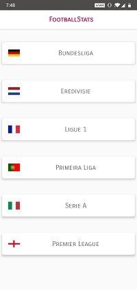
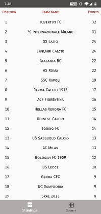
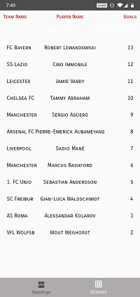

# FootballStats
Stats info on popular football leagues in Europe.
  
Used: 
• MVVM design pattern. 
• Room persistance library. 
• Retrofit for interacting with RestAPIs. 
• RxJava for asynchronous programming and threading. 
• BottomNav to present single tasks. 
• Dagger2 dependency injection library. 
• Unit and integration testing. 
 
 
Screens:
 

